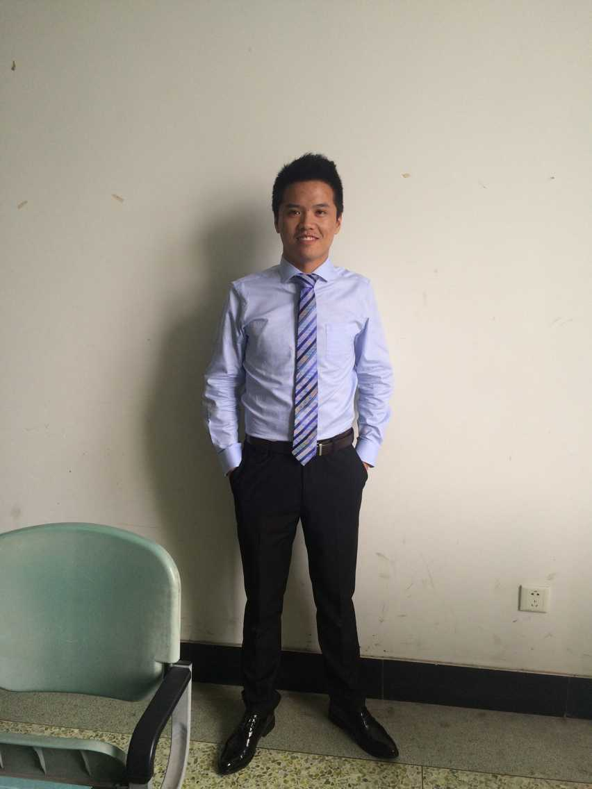

###我的信息
---

我叫鲍黎,英文名OliverBao,是一名在校学生.

座右铭:**stay hungry stay foolish**

热爱技术和ACM,比较喜欢的技术是django,喜欢的编程语言Python,C/C++,不喜欢编程语言Java,尽管它非常牛.

做过几年的ACM竞赛,账号是**royecode**,常在一些网站刷题:

* [Codeforces](http://codeforces.com)
* [POJ](http://poj.org)
* [HDOJ](http://acm.hdu.edu.cn)
* [BC](http://bestcoder.hdu.edu.cn/)
* [Leetcode](http://leetcode.com)

平时喜欢 浏览技术文章网站如下:

* [github网站](http://github.com)
* [陈皓的个人博客网站](http://coolshell.cn)
* [linux中国](http://linux.cn)
* [LinuxStory](http://www.linuxstory.org)
###与我联系
---
* Email:Royecode@163.com
* [博客:blog.csdn.net/royecode](http://blog.csdn.net/royecode)
* [微博:http://weibo.com/u/3796329175](http://weibo.com/u/3796329175)
* [github地址:http://github.com/oliverbaoa](http://github.com/oliverbaoa)

